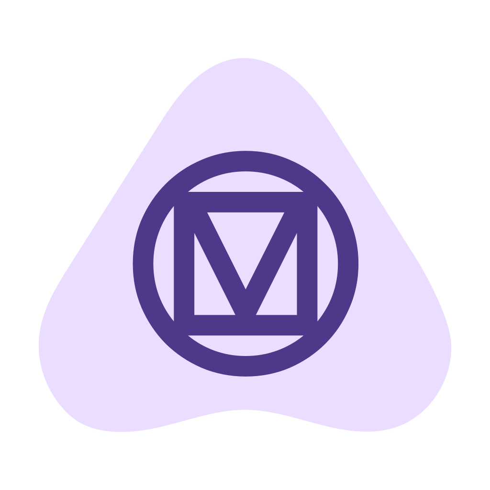
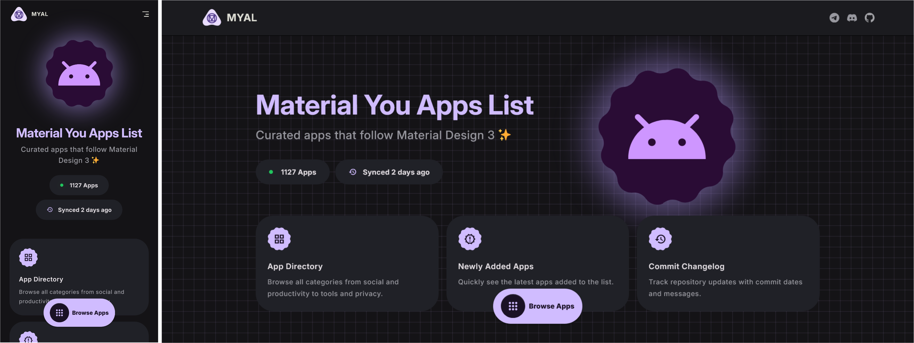
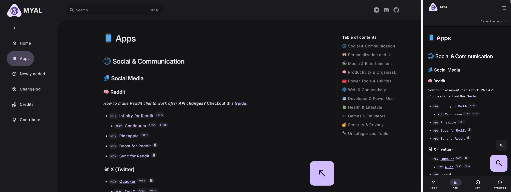

  
  <h1>Material You App List</h1>

Discover Android apps that support Material Design 3, all in one place.

App data is synced automatically from [nyas1/Material-You-app-list](https://github.com/nyas1/Material-You-app-list).

## ✨ Features

- Material Design 3 interface
- Search apps quickly
- Filter FOSS-only apps
- Hide archived apps
- Tag filters (MD3E, MDY, MD, MY)
- Table of contents sidebar for quick navigation
- Live app count on homepage
- Changelog synced from upstream repo

## 📷 Screenshots

    
  

## 🤝 Contribute

- **App additions/updates:** create an issue or PR in the main list repo:
[nyas1/Material-You-app-list](https://github.com/nyas1/Material-You-app-list)
- **Website changes (this repo):** create an issue or PR here:
[nyas1/myal-web](https://github.com/nyas1/myal-web)
